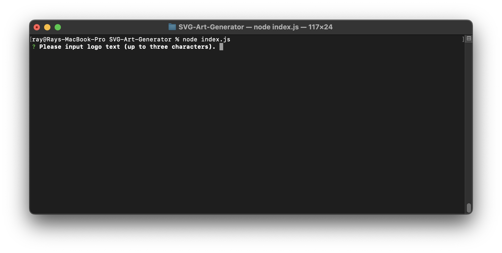
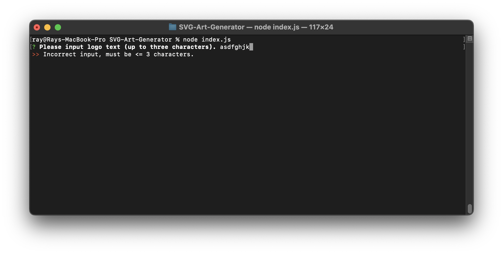
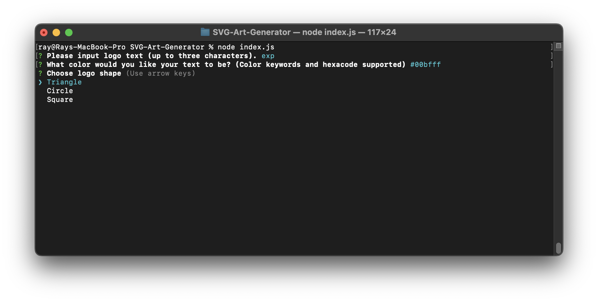
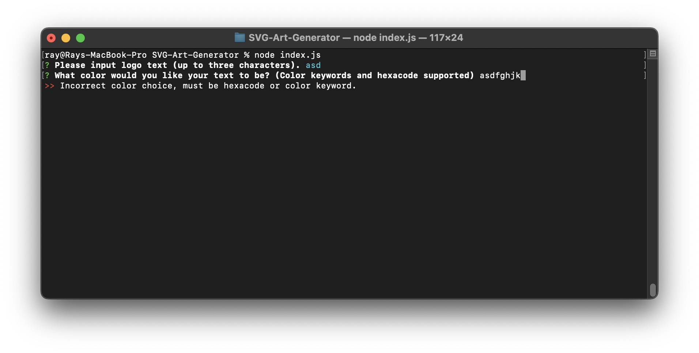
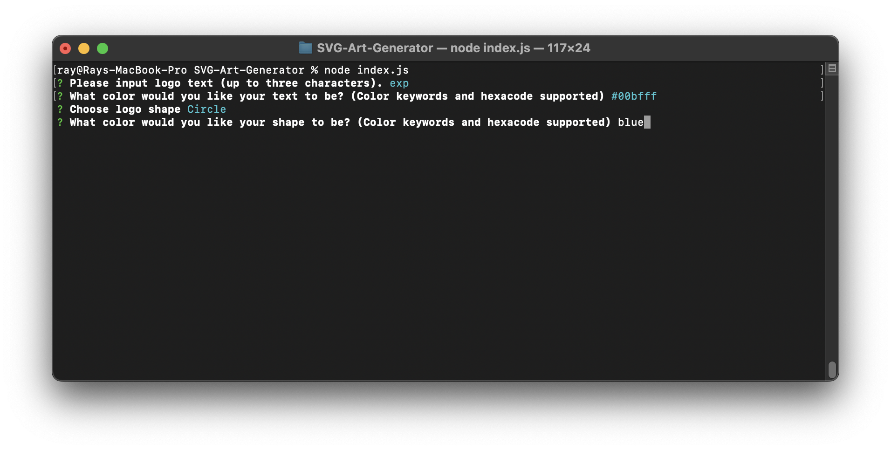
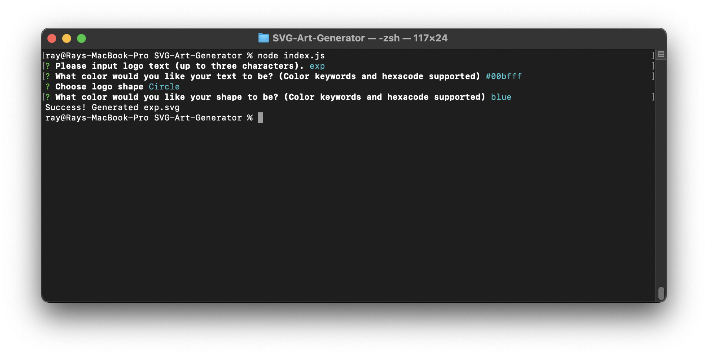
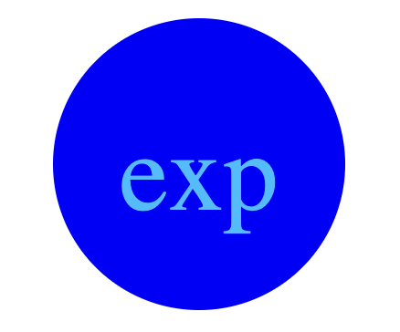

# SVG Generator (UCSD Challenge #10)

## Description

- A user-interactive .svg file generator using NodeJS. User can choose a shape, a shape color, text, and text color.
- Custom user-generated logos can be generated for uses in placeholder logos and images for web applications.
- This application has furthered my proficiency in Test Driven Development and Object Oriented Programming.

## Installation

1. Ensure you have NodeJS installed to utilize this application. [Click here to visit the NodeJS Website.](https://nodejs.org/en)
2. Clone the Git repository (RECOMMENDED) or download the source ZIP.
3. After cloning or extracting the repo, open your Command Line application (Command prompt/Terminal) and navigate to your repository's directory.
4. In the command line, do `npm i` to download the needed npm packages.
5. After installing the necessary packages, run the application by typing `node index.js` in your command line.

## Usage

**After typing `node index.js` in your command line, you will be greeted with input for your logo's text.**

**NOTE: if you input a name longer than three characters, you will be presented with this error:**

**Afterwards, you will be asked to input a color for the text. Color keywords and hexacode codes are supported.**

**NOTE: if you input an incorrect color, or a color other than a keyword or hexacode, you will be presented with this error:**

**Next, you will be asked to select a shape.**

**You will next be asked to input a color for the shape. Color keywords and hexacode codes are supported. After inputting a correct color, you will get a "Success!" message.**

**NOTE: if you input an incorrect color, or a color other than a keyword or hexacode, you will be presented with the same error from the text-color.**

**You can then locate the file in the `/examples` folder found in the repository. The name of the SVG file will be the name of your logo. Below is an example output file opened in the browser.**

## Tests

- JavaScript tests are found in the `./lib/tests/` folder of the GitHub Repo.
- Two tests are inside this folder to check the integrity of the shapes.js and validate.js functions.
- To run these tests, ensure you have installed the `jest` package from npm.
- Afterwards, do `npm run test` to run all tests.

## License

MIT License

Copyright (c) 2023 Ray Badua

Permission is hereby granted, free of charge, to any person obtaining a copy
of this software and associated documentation files (the "Software"), to deal
in the Software without restriction, including without limitation the rights
to use, copy, modify, merge, publish, distribute, sublicense, and/or sell
copies of the Software, and to permit persons to whom the Software is
furnished to do so, subject to the following conditions:

The above copyright notice and this permission notice shall be included in all
copies or substantial portions of the Software.

THE SOFTWARE IS PROVIDED "AS IS", WITHOUT WARRANTY OF ANY KIND, EXPRESS OR
IMPLIED, INCLUDING BUT NOT LIMITED TO THE WARRANTIES OF MERCHANTABILITY,
FITNESS FOR A PARTICULAR PURPOSE AND NONINFRINGEMENT. IN NO EVENT SHALL THE
AUTHORS OR COPYRIGHT HOLDERS BE LIABLE FOR ANY CLAIM, DAMAGES OR OTHER
LIABILITY, WHETHER IN AN ACTION OF CONTRACT, TORT OR OTHERWISE, ARISING FROM,
OUT OF OR IN CONNECTION WITH THE SOFTWARE OR THE USE OR OTHER DEALINGS IN THE
SOFTWARE.
